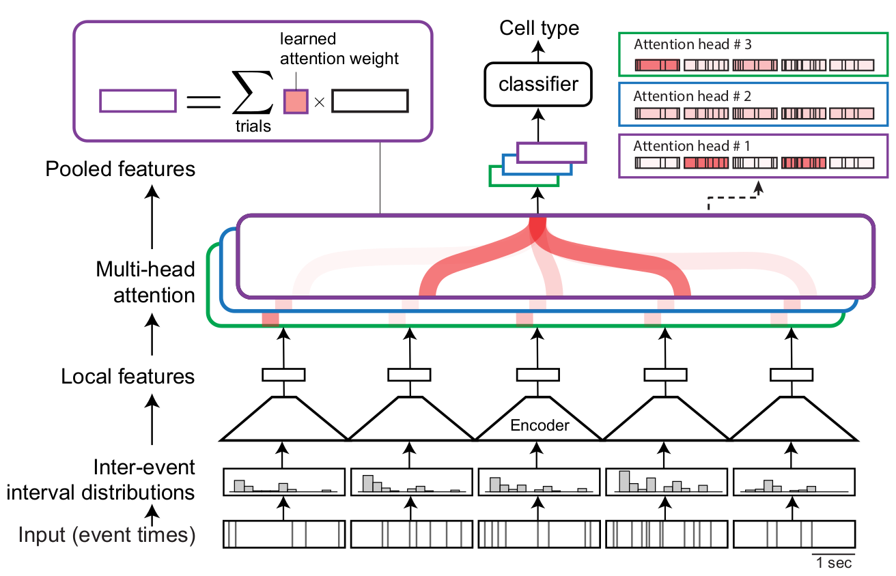

# LOLCAT

>Schneider, A., Azabou, M., McDougall-Vigier, L., Parks, D. B., Ensley, S., Bhaskaran-Nair, K., Nowakowski, T., Dyer, E. L. & Hengen, K. B. (2022). Transcriptomic cell type structures in vivo neuronal activity across multiple time scales. To appear in Cell Reports.

Temporarily code for LOLCAT is publicly available at https://www.dropbox.com/s/rtztxms0e3ri4rr/cell_type_022123.zip?dl=0 . This code will be available here with full documentation prior to publication.

In the meantime, if you have any questions or comments, please feel free to reach out to us.
